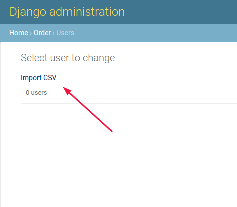
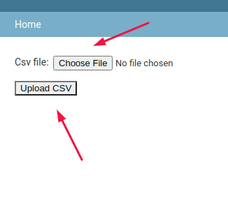
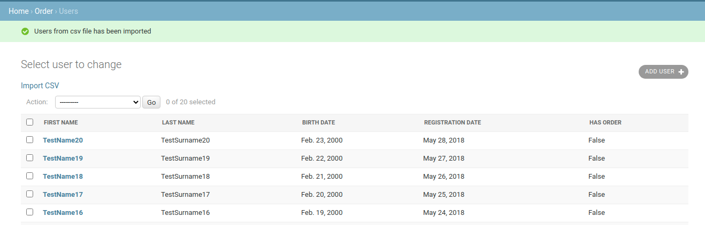

# CSV-Saver + API
- Import csv and save objects to db;
- Get data on API;

### Installation
- Create and activate venv:
    ```sh
    $ python3 -m venv example.env
    $ source example.env/bin/activate
    ```

- Install dependencies from requirements.txt:
    ```sh
    $ pip install -r requirements.txt
    ```
- Create migrations and user, run server:
    ```sh
    $ python manage.py makemigrations
    $ python manage.py migrate
    $ python manage.py createsupeuser
    $ python manage.py runserver
    ```
- Go to [***localhost***](http://127.0.0.1/admin)

### Import CSV to DB
- Go [***localhost/admin/order/user***](http://127.0.0.1:8000/admin/order/user/):
- Click **Import CSV**

- Choose file.csv and upload:

- Congrats, data saved:


### API
- Get all users - send GET for [***localhost/api/all-users/***](http://127.0.0.1:8000/api/all-users/).
- Get all users - send GET with url-parameter  for [***localhost/api/date-users/{registration_date}***](http://127.0.0.1:8000/api/date-users/2018-05-28).
- See examples on [***api-docs***](https://documenter.getpostman.com/view/10930486/T1LFoAXq?version=latest).


